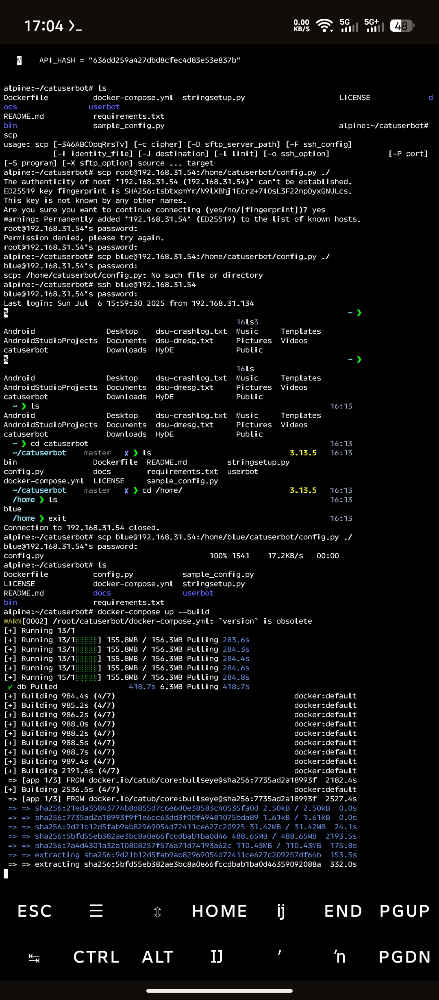
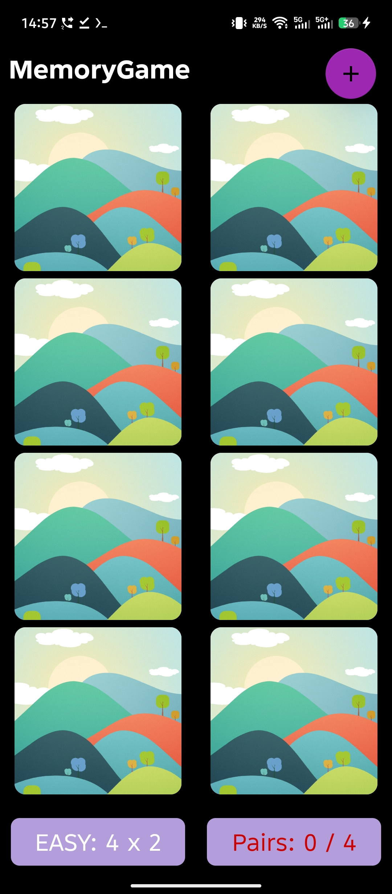
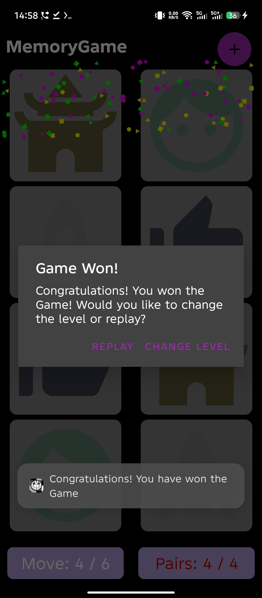
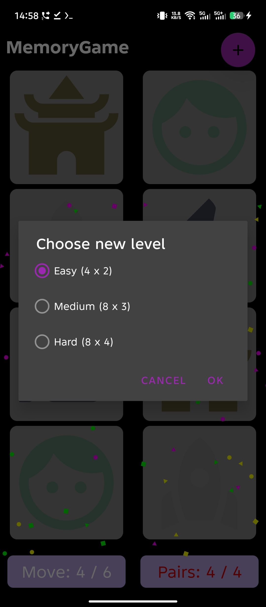
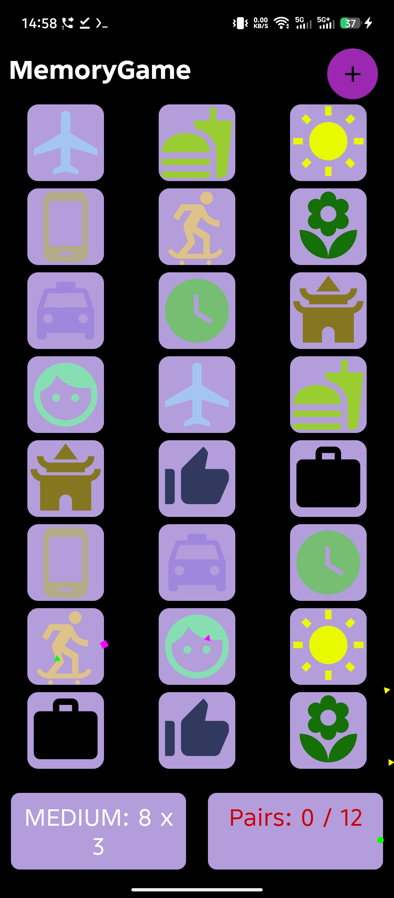

# Card Matching Game

Welcome to the Card Matching Game! This is a fun and engaging game where you flip cards to match their icons. Developed as a mobile game for Android, this project is a great example of interactive design and game mechanics.

## Features

- **Simple Gameplay:** Flip cards to find matching pairs.
- **Challenging Levels:** Increase difficulty as you progress.

<!-- Force One-Line Horizontal Scroll -->

  
  
  
  
  

## Getting Started

To get started with the Card Matching Game, follow these steps:

### Prerequisites

- **Android Device:** Ensure you have an Android device or emulator.
- **APK File:** The installation file can be downloaded from the releases section.

### Installation

1. **Download the APK:**
   Visit the [Releases](https://github.com/Sauban-Git/MemoryGame/releases) section of this repository and download the latest APK file.
   
2. **Install the APK:**
   - On your Android device, go to **Settings > Security** and enable **Unknown Sources** if it is not already enabled.
   - Locate the downloaded APK file in your device's file manager and tap on it to begin the installation process.
   - Follow the on-screen instructions to complete the installation.

3. **Launch the Game:**
   Once installed, open the app from your device’s app drawer and start playing!

## Usage

- **Start the Game:** Launch the app and tap on cards to flip them.
- **Match Icons:** Find pairs of matching icons to clear the board.
- **Track Progress:** The game keeps track of your moves and pairs matched.

## Contributing

Contributions are welcome! If you have suggestions or improvements, please fork the repository and submit a pull request. For larger changes, open an issue to discuss your ideas.

## License

This project is licensed under the Apache License. See the [LICENSE](LICENSE) file for details.

## Acknowledgments

A special thanks to the Android community for their support and resources that made this project possible. Your contributions and tools have been invaluable!

## Contact

For any questions or feedback, feel free to mail me at [Email](mailto:sauban.ind@gmail.com).
